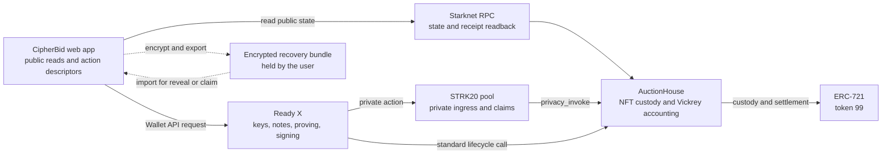
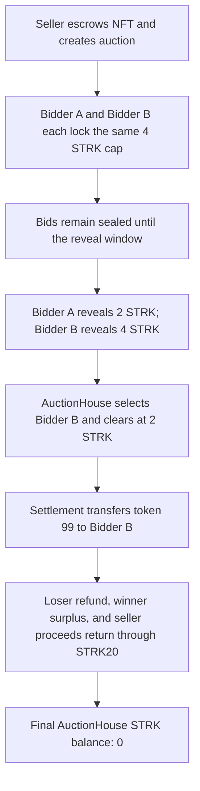

# CipherBid

[](https://github.com/SourceSenseiTheRealOne/cipherbid/actions/workflows/ci.yml)
[](https://github.com/SourceSenseiTheRealOne/cipherbid/actions/workflows/deploy-pages.yml)

**Private bids, guaranteed onchain delivery.**

CipherBid is a Vickrey NFT auction on Starknet where every accepted bidder locks the same STRK collateral cap through STRK20. The actual bid stays sealed until reveal. Settlement sends the NFT to the winner at the greater of the reserve or second-highest valid bid, and every refund, surplus, and seller payment returns through private STRK20 claims.

[Open the live mainnet auction](https://sourcesenseitherealone.github.io/cipherbid/auction/?id=1788040057342) · [Watch the final demo](https://youtu.be/pYZk6KXko7o) · [Read the transaction ledger](docs/evidence/mainnet/transactions.md) · [Use the presentation script](docs/demo-presentation-script.md)

## The 30-second version

Many auction demos hide a bid with a hash but do not prove the bidder can pay. Escrowing each bidder's exact amount fixes funding but leaks the bid through the public token transfer.

CipherBid locks the same public `4 STRK` cap for both bidders. Observers see funded bids with equal collateral, but not whether the sealed bid is `2 STRK` or `4 STRK`. After reveal, the contract calculates the Vickrey price, transfers the escrowed NFT in the same settlement transaction, and accounts for every remaining STRK claim.

Atomic settlement means all-or-nothing delivery. Winner selection, second-price accounting, and the NFT transfer succeed together or the transaction reverts. There is no accepted state where CipherBid records a winner but leaves the NFT with the seller.

> **Verified mainnet result:** auction [`1788040057342`](https://sourcesenseitherealone.github.io/cipherbid/auction/?id=1788040057342) completed two private equal-cap bids, two reveals, second-price settlement, atomic NFT delivery, bidder claims, and the final seller claim. Five published CipherBid transactions touched the canonical STRK20 pool.

## Why this is more than a minimal commit/reveal demo

| Minimal commit/reveal demo                        | CipherBid                                                                                    |
| ------------------------------------------------- | -------------------------------------------------------------------------------------------- |
| A hash can be submitted without funded collateral | Every accepted bid moves the same real STRK cap through the live STRK20 pool                 |
| Exact escrow can leak the bid before reveal       | Equal collateral hides which value at or below the cap was committed                         |
| Delivery can remain a separate manual step        | The NFT enters custody at creation and moves to the winner inside settlement                 |
| Refunds often use public transfers                | Loser refund, winner surplus, and seller proceeds use STRK20 open-note claims                |
| Recovery is left outside the demo                 | Password-encrypted credentials bind to network, contract, auction, role, and claim handle    |
| Success is usually shown with local tests         | Mainnet receipts, CipherBid events, pool traces, NFT ownership, and zero residual accounting |

## Why equal collateral matters

A STRK20 `privacy_invoke` withdraws tokens from the privacy pool to the helper through a public ERC-20 edge. Escrowing each bidder's variable bid would reveal that amount before the reveal phase. CipherBid therefore locks the same cap for every accepted bidder. The public transfer proves every bid is funded without disclosing whether the sealed bid is `2 STRK`, `4 STRK`, or another value at or below the cap.

This is **STRK20-funded sealed bidding with equalized real collateral**. It is not an unfunded hash-only auction, and it does not claim bids remain private after reveal.

## Verified mainnet deployment

| Component                | Address / transaction                                                                                                                                                      |
| ------------------------ | -------------------------------------------------------------------------------------------------------------------------------------------------------------------------- |
| AuctionHouse             | [`0x01b32af8bab712ede82117b8ff1b8866e09798f6c81edc255ffe59dd42e4843e`](https://voyager.online/contract/0x01b32af8bab712ede82117b8ff1b8866e09798f6c81edc255ffe59dd42e4843e) |
| DemoERC721               | [`0x05c7080c583304469e853e472d46a20448ff82bf9ee4c87a8efabc35f8177e1f`](https://voyager.online/contract/0x05c7080c583304469e853e472d46a20448ff82bf9ee4c87a8efabc35f8177e1f) |
| Demo NFT                 | Token ID `99`                                                                                                                                                              |
| STRK20 pool              | `0x040337b1af3c663e86e333bab5a4b28da8d4652a15a69beee2b677776ffe812a`                                                                                                       |
| STRK token               | `0x04718f5a0fc34cc1af16a1cdee98ffb20c31f5cd61d6ab07201858f4287c938d`                                                                                                       |
| AuctionHouse declaration | [`0x552781e5ecb2ab9826474c8395ca5fd2f534ce6155367ab67ae195f5e2c9dc6`](https://voyager.online/tx/0x552781e5ecb2ab9826474c8395ca5fd2f534ce6155367ab67ae195f5e2c9dc6)         |
| DemoERC721 declaration   | [`0x01efc7df78014f252d346af3b88a5035b002cf005079604f6e3bf9df0f1fa9b`](https://voyager.online/tx/0x01efc7df78014f252d346af3b88a5035b002cf005079604f6e3bf9df0f1fa9b)         |

Deployment readback confirmed the reviewed class hashes, canonical pool and STRK token, a maximum of 32 bidders, and initial deployer ownership of NFT `99`. The [verified lifecycle](docs/evidence/mainnet/auction-lifecycle.md) now proves token `99` was delivered to Bidder B during settlement. See the [deployment evidence](docs/evidence/mainnet/deployment.md) and [machine-readable manifest](docs/evidence/mainnet/deployment.json).

## Public frontend

The production frontend is live at [`https://sourcesenseitherealone.github.io/cipherbid/`](https://sourcesenseitherealone.github.io/cipherbid/). Its source-controlled deployment workflow uses immutable action pins, least-privilege token permissions, and only public mainnet configuration. The [`main` deployment, workflow, Pages settings, and public browser routes were independently read back](docs/evidence/submission/pages-deployment.md).

The exportable live-auction route is `/auction?id=<positive-u64>`. It validates one auction ID, reads public Starknet state in the browser, verifies the deployed class/configuration and NFT custody, then renders wallet controls. Ready X still owns private-note discovery, proving, signing, and submission.

The final [2:24 public demo video](https://youtu.be/pYZk6KXko7o) follows this page through equal collateral, the `2/4 STRK` result, private claims, and atomic delivery. The [presentation script](docs/demo-presentation-script.md) remains available for the complete talk track and judge Q&A.

## Verified mainnet demo

The bounded mainnet demo uses one seller, two separate Ready X accounts, and one read-only observer:

| Term                    |             Value |
| ----------------------- | ----------------: |
| Reserve                 |          `1 STRK` |
| Equal collateral cap    |          `4 STRK` |
| Bidder A sealed bid     |          `2 STRK` |
| Bidder B sealed bid     |          `4 STRK` |
| Verified winner         |          Bidder B |
| Verified clearing price |          `2 STRK` |
| Loser refund            |          `4 STRK` |
| Winner surplus          |          `2 STRK` |
| Seller proceeds         | `2 STRK`, claimed |
| Final house balance     |          `0 STRK` |
| Bidding window          |        10 minutes |
| Reveal window           |         5 minutes |

Both bidders shielded `24 STRK` and passed the ten-block maturity gate before the timed auction started. Public readiness verified registration, deposit amount, and maturity only. Ready X remained authoritative for unspent private-note balance.

## Architecture



CipherBid never receives the wallet's viewing key, private notes, proof witness, or signer key. Ready X owns those operations. The web app constructs bounded public descriptors, keeps active auction credentials in memory, encrypts recovery exports, and verifies every submitted transition through public RPC readback.

## Mainnet user flow



## Roadmap: token launch auctions

The next research direction is to extend CipherBid from one-unit NFT sales to multi-unit token launches. Participants would submit funded sealed demand, reveal after the bidding window, and settle allocations at an onchain clearing price.

That extension needs a new allocation and settlement contract, including multi-unit accounting and claim rules. It is roadmap work, not functionality claimed by the current verified ERC-721 deployment.

### Commitment binding

A bid commitment binds the domain tag, Starknet chain ID, AuctionHouse address, auction ID, bid amount, random nonce, claim handle, and NFT recipient. Recovery material is also bound to network, chain ID, deployment, and auction ID before reveal or claim.

### Contract invariants

- Only the configured STRK20 pool may call `privacy_invoke`.
- Ingress is accounted from the helper's actual STRK balance delta.
- Every accepted bidder locks the same cap.
- Bidder count and settlement work are bounded.
- NFT custody is established during auction creation and delivery is part of settlement.
- Claims are one-time and commitment-bound.
- All `u256 → u128` conversions are checked.
- External interactions follow checks-effects-interactions and reentrancy protection.

## Privacy boundary

| Public                                                   | Private before reveal                               |
| -------------------------------------------------------- | --------------------------------------------------- |
| Auction terms, NFT, reserve, cap, and deadlines          | Bid amount and random bid nonce                     |
| STRK20 registration and public deposits                  | Private-note ownership and note-selection witnesses |
| Identical collateral transfer amount                     | Wallet viewing key and proof witness                |
| Bid count and transaction timing                         | Claim secret                                        |
| Revealed bids, winner, and clearing price                | Bidder's main-wallet linkage inside the pool        |
| Withdrawals, open-note edges, and direct lifecycle calls | Recovery plaintext outside its active in-memory use |

Ready X owns private-note discovery, proof generation, signing, and private transaction submission. CipherBid never requests a viewing key or private-note witness. The browser does hold the active bid credential briefly to construct the interaction and encrypt an exportable recovery bundle; plaintext secrets must never enter browser storage, logs, analytics, URLs, clipboard, Git, or a backend.

## Threat model and limitations

CipherBid protects the bid amount until reveal and prevents an unfunded winner, but it does not provide perfect anonymity:

- deposits, withdrawals, open-note amounts, timing, and public account activity remain visible;
- distinctive amounts or tightly timed setup can shrink the anonymity set;
- opening a channel near a public action may create timing linkage;
- every valid reveal makes the bid amount public by design;
- a malicious web page could substitute dapp-built Wallet API actions before the wallet prompt, so users must verify target and amount in Ready X;
- wallet, prover, relayer, RPC, screening, and browser availability remain operational dependencies;
- private balances cannot be verified by the dapp;
- the present contracts and signer configuration are a bounded hackathon demo, not an audited production deployment.

STRK20's auditor disclosure mechanism can reveal activity under its protocol policy; a viewing key can read but cannot spend funds.

## Repository layout

```text
contracts/                  Cairo AuctionHouse and DemoERC721
web/                        Next.js application and Wallet API integration
context/                    Product, architecture, security, and stack decisions
docs/evidence/              Secret-free specifications and public readbacks
strk20.json                 Final verified submission metadata
```

## Local development

### Prerequisites

- Node.js 24
- pnpm 10
- Cairo compiler 2.20.0
- Scarb 2.20.1
- Starknet Foundry 0.63.0
- Ready X for real STRK20 wallet flows

### Install and configure

```bash
npx --yes pnpm@10.18.1 --dir web install --frozen-lockfile
cd web
npx --yes pnpm@10.18.1 exec tsx scripts/configure-mainnet-env.ts \
  --deployment-record ../docs/evidence/mainnet/deployment.json \
  --write
```

The configuration command writes only public deployment values and refuses to overwrite an existing `.env.local`.

### Run

```bash
cd web
npx --yes pnpm@10.18.1 exec next dev --webpack -p 4110
```

Open:

- `http://127.0.0.1:4110/` — auction browser
- `http://127.0.0.1:4110/auction?id=1` — public auction reader; ID `1` remains unavailable until a real auction exists
- `http://127.0.0.1:4110/create` — seller creation flow
- `http://127.0.0.1:4110/demo/setup` — Ready X bidder shielding

### Contract checks

```bash
cd contracts
scarb fmt --check
scarb build
snforge test
```

### Web checks

```bash
npx --yes pnpm@10.18.1 --dir web format:check
npx --yes pnpm@10.18.1 --dir web lint
npx --yes pnpm@10.18.1 --dir web typecheck
npx --yes pnpm@10.18.1 --dir web test
npx --yes pnpm@10.18.1 --dir web test:e2e
npx --yes pnpm@10.18.1 --dir web pages:verify
npx --yes pnpm@10.18.1 --dir web build
CIPHERBID_PAGES_BUILD=1 npx --yes pnpm@10.18.1 --dir web build
```

## Operational scripts

Mainnet write scripts default to plan-only and require explicit `--execute`:

```bash
cd web
npx --yes pnpm@10.18.1 run deploy:mainnet
npx --yes pnpm@10.18.1 run auction:preflight:mainnet
npx --yes pnpm@10.18.1 exec tsx scripts/create-mainnet-auction.ts --auction-id <id>
```

Do not add `--execute` until the printed plan, signer, network, public bidder readiness, recovery destination, and remaining release budget have been verified. Never commit `.env.local`, wallet state, recovery bundles, runtime evidence, browser state, or signing material.

## Evidence

- [Evidence index](docs/evidence/README.md)
- [Mainnet deployment](docs/evidence/mainnet/deployment.md)
- [Verified mainnet transaction ledger](docs/evidence/mainnet/transactions.md)
- [Verified mainnet auction lifecycle](docs/evidence/mainnet/auction-lifecycle.md)
- [Final public demo video evidence](docs/evidence/submission/demo-video.md)
- [Live demo presentation script](docs/demo-presentation-script.md)
- [Mainnet release candidate](docs/evidence/mainnet/release-candidate.md)
- [Canonical demo matrix](docs/evidence/task-0-demo-matrix.md)
- [Lifecycle specification](docs/evidence/task-2-3-lifecycle-specification.md)
- [Security invariants](docs/evidence/task-2-4-security-invariants.md)
- [Hackathon requirements matrix](docs/evidence/hackathon-requirements-matrix.md)
- [Sepolia rehearsal](docs/evidence/sepolia/demo-runbook.md)

`strk20.json` contains two verified contracts, five successful pool-touching CipherBid transactions, the clean-browser-verified auction URL, and the public 2:24 YouTube demo.

## Scope

The sprint MVP supports one STRK payment token, ERC-721 assets, one-unit Vickrey auctions, and at most 32 bidders. It intentionally excludes a broad marketplace, first-price or multi-unit auctions, ERC-1155, off-chain delivery, user accounts, a database, a custom prover, and custom privacy cryptography.

## License

[MIT](LICENSE)
