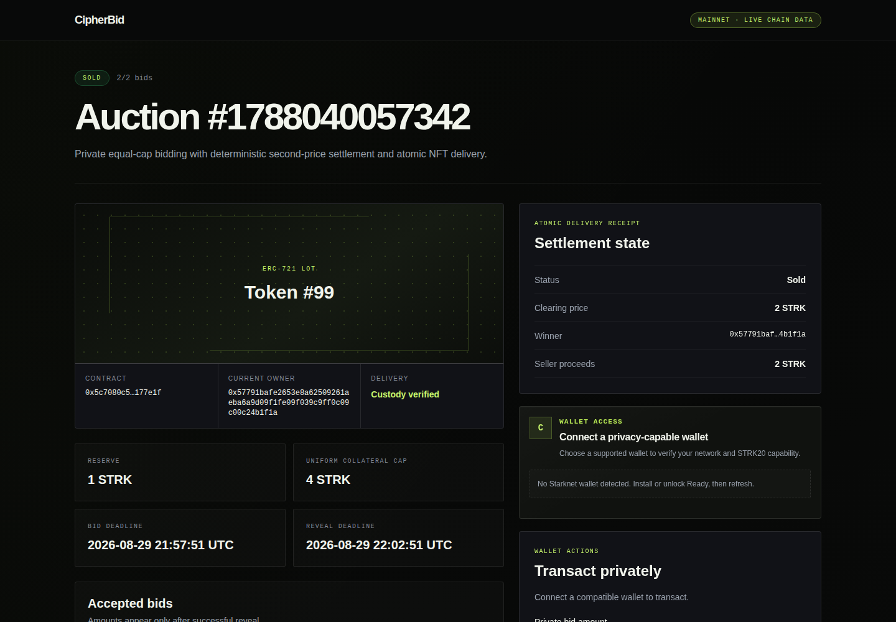

# CipherBid

Funded, sealed-bid NFT auctions on Starknet, with atomic delivery and STRK20 settlement claims.

Each bidder locks the same public collateral cap, keeping the transfer amount from exposing the bid. Bids become public during reveal. The highest valid bid wins at the greater of the reserve or second-highest bid, and settlement transfers the escrowed NFT in the same transaction.

**Status:** built for the STRK20 Private Sprint and exercised on Starknet mainnet. The organizer registry lists the project as finished, with demo, video and mainnet requirements satisfied. This is a bounded hackathon deployment, not an audited production service.

[Live mainnet auction](https://sourcesenseitherealone.github.io/cipherbid/auction/?id=1788040057342) · [Demo video](https://youtu.be/pYZk6KXko7o) · [Transaction ledger](docs/evidence/mainnet/transactions.md) · [Submission readback](docs/evidence/submission/hub-status.md)

[](https://sourcesenseitherealone.github.io/cipherbid/auction/?id=1788040057342)

## Mainnet result

The published auction accepted two bids backed by the same `4 STRK` cap. They revealed `2 STRK` and `4 STRK`; the higher bidder received NFT `99` at a `2 STRK` clearing price. The loser refund, winner surplus and seller proceeds were claimed through STRK20. The recorded final actual and accounted AuctionHouse balances were zero.

The [lifecycle record](docs/evidence/mainnet/auction-lifecycle.md) links each state transition to its receipt. The [deployment manifest](docs/evidence/mainnet/deployment.json) identifies the contracts and class hashes; [`strk20.json`](strk20.json) lists the five qualifying pool-touching transactions.

<details>
<summary>Mainnet contract addresses</summary>

- AuctionHouse: [`0x01b32af8bab712ede82117b8ff1b8866e09798f6c81edc255ffe59dd42e4843e`](https://voyager.online/contract/0x01b32af8bab712ede82117b8ff1b8866e09798f6c81edc255ffe59dd42e4843e)
- DemoERC721: [`0x05c7080c583304469e853e472d46a20448ff82bf9ee4c87a8efabc35f8177e1f`](https://voyager.online/contract/0x05c7080c583304469e853e472d46a20448ff82bf9ee4c87a8efabc35f8177e1f)

</details>

## Engineering decisions

- Equal collateral prevents the public transfer into the auction contract from disclosing each bid amount. It costs capital efficiency: every accepted bidder funds the full cap.
- The Cairo contract checks pool-only ingress, observed token balances, commitment uniqueness and one-time claims. Settlement is bounded to at most 32 bidders.
- NFT custody begins when the auction is created. Winner selection, price accounting and delivery either complete together or revert.
- A supported wallet owns signing, private-note discovery and proving. Auction credentials exist in active browser memory and password-encrypted recovery files, with import verification before submission.
- The UI validates the deployed class, pool and token before rendering chain state. Transaction confirmation requires the expected receipt, event and state readback.

[Engineering notes](docs/engineering.md) explain the state machine, commitment binding, failure handling, accounting and privacy limits.

## Stack and layout

| Area | Implementation |
| --- | --- |
| Contracts | Cairo, OpenZeppelin Contracts, Scarb, Starknet Foundry |
| Web | Next.js, React, strict TypeScript, Tailwind CSS |
| Chain access | starknet.js and Starknet Wallet API |
| Verification | Vitest, Testing Library, Playwright, Cairo tests |
| Hosting | Static Next.js export on GitHub Pages |

```text
contracts/       AuctionHouse, ERC-721 demo asset and contract tests
web/             Public chain reader, wallet actions and encrypted recovery
context/         Architecture, product scope and security boundaries
docs/evidence/   Mainnet receipts, deployment records and submission evidence
```

There is no application database, custodial backend, custom prover or custom privacy cryptography.

## Run locally

Use Node.js 24 and the pinned package manager. From the repository root:

```bash
npx --yes pnpm@10.18.1 --dir web install --frozen-lockfile
cd web
npx --yes pnpm@10.18.1 exec tsx scripts/configure-mainnet-env.ts \
  --deployment-record ../docs/evidence/mainnet/deployment.json --write
npx --yes pnpm@10.18.1 exec next dev --webpack --hostname 127.0.0.1 -p 4110
```

The configuration command writes public deployment values and refuses to overwrite an existing `.env.local`. Open `http://127.0.0.1:4110/auction?id=1788040057342` to inspect the published auction without connecting a wallet. The homepage demo link always opens the public mainnet site.

[Local development](docs/local-development.md) covers checks, Pages builds, the pinned Cairo toolchain and [unresolved server-side dependency advisories](docs/local-development.md#dependency-advisory-caveat). [CI](https://github.com/SourceSenseiTheRealOne/cipherbid/actions/workflows/ci.yml) runs web and contract gates; [the deployment workflow](.github/workflows/deploy-pages.yml) publishes `main` to the existing `/cipherbid` site.

## Limits

The implementation supports one-unit ERC-721 auctions paid in STRK. Multi-unit token launches remain research, not shipped functionality. Deposits, timing, equal-cap transfers, revealed bids and open-note edges are public; this does not provide permanent bid secrecy or perfect anonymity.

Wallet, prover, relayer, RPC and screening services remain dependencies. Pool fees can exceed small claims: the recorded demo seller claim paid a `6 STRK` pool fee to recover `2 STRK`, excluding authorization gas. Mainnet execution proves the bounded lifecycle, not economic viability or audited security. Never use funds you cannot afford to lose.

[MIT license](LICENSE) · [Third-party notices](THIRD_PARTY_NOTICES.md) · [Full evidence index](docs/evidence/README.md)
